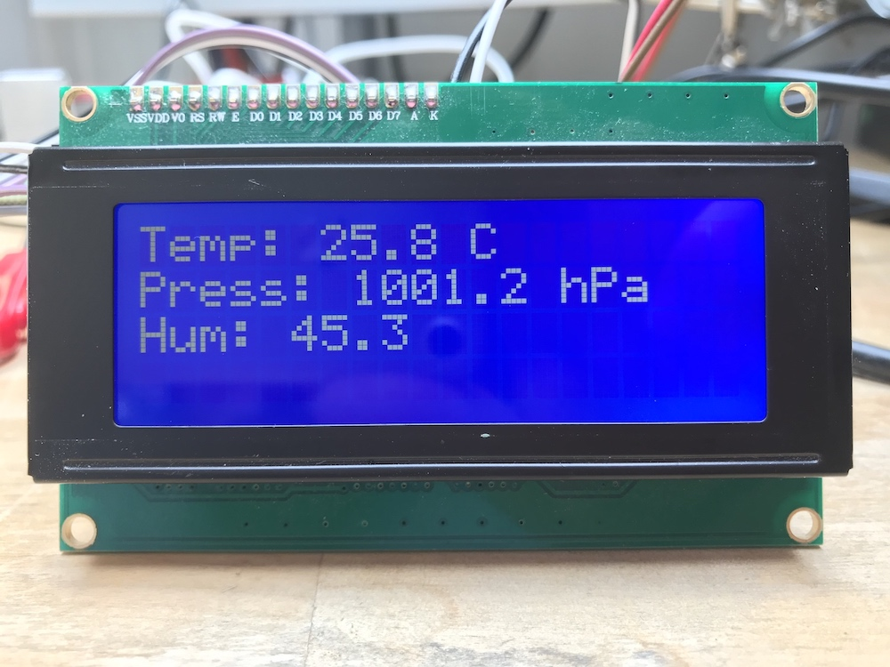

# Go LCM1602 LCD driver

This project aims to provide Go support for the LCM1602 LCD driver. I use it for displaying climate data in my office:



## Usage

See this example code:

```go
package main

import (
	lcd "github.com/wjessop/lcm1602_lcd"
)

func main() {
	// Configure this line with the device location and address of your device
	lcdDevice, err := i2c.Open(&i2c.Devfs{Dev: "/dev/i2c-1"}, 0x27)
	if err != nil {
		log.Fatal(err)
	}
	defer lcdDevice.Close()

	lcdDisplay, err = lcd.NewLCM1602LCD(lcdDevice)
	if err != nil {
		log.Fatal(err)
	}

	// Write a string to row 1, position 0 (ie, the start of the line)
	if err := lcdDisplay.WriteString("Hello World!"), 1, 0); err != nil {
		log.Fatal(err)
	}

	// Write a string to row 2, position 7
	if err := lcdDisplay.WriteString("(>'.'<)", 2, 7); err != nil {
		log.Fatal(err)
	}

	if err := lcdDisplay.Clear(); err != nil {
		log.Fatal(err)
	}
}
```

You can write to all 4 of the lines, you just need to set the second paramter of the `WriteString` function to the line you want, 1 through 4.

## Contributing

Bug reports and pull requests are welcome on GitHub at https://github.com/wjessop/lcm1602_lcd.

## License

MIT, see [LICENSE](LICENSE) file.

## Prior work

This Go library is based on (python) code and research that appears in a number of places on the Internet, but I couldn't find one authoratitive person responsible or to thank for it, but thank you kindly Internet strangers for your prior work.
